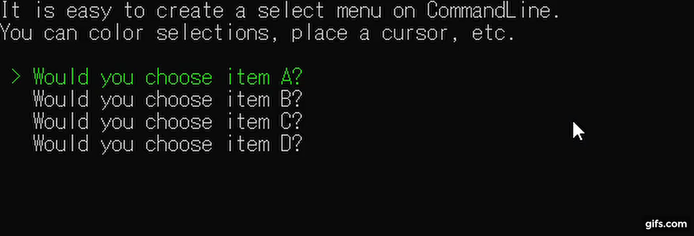

# CommandLineSelectableMenu


  
Provides a command line only selectable menu. It is very easy to implement interactive selectable menus.

## Features
1. Selectable menu that works on CommandLine.

## Installing and Getting started
### 1. install package.
`CommandLineSelectableMenu` is available for download and installation as [NuGet packages](https://www.nuget.org/packages/CommandLineSelectableMenu/).
```
Install-Package CommandLineSelectableMenu -Version <version>
```

### 2. Create your own menu as you see fit.

```csharp
using CommandLineSelectableMenu;
using System;

public class Program
{
    public static void Main(string[] args)
    {
        // create selectable menu instance.
        var selectableMenu = new SelectableMenu<Action>();

        // add menu item.
        selectableMenu.Add("Choose item A?", () => { Console.WriteLine("A Selected!!"); });
        selectableMenu.Add("Choose item B?", () => { Console.WriteLine("B Selected!!"); });
        selectableMenu.Add("Choose item C?", () => { Console.WriteLine("C Selected!!"); });
        selectableMenu.Add("Choose item D?", () => { Console.WriteLine("D Selected!!"); });

        // draw selectable menu on console.
        var item = selectableMenu.Draw();
        item.Invoke();
    }
}
```

## Demo
It is easy to create a selectable menu that works on CommandLine.  
If you are interested, please see the sample [here](https://github.com/atEaE/commandLineSelectableMenu/tree/master/examples/SelectableMenuExample).  

## Contributing
Pull requests and stars are always welcome.
Contributions are what make the open source community such an amazing place to be learn, inspire, and create.   
Any contributions you make are greatly appreciated.

1. Fork the Project.
2. Create your Feature Branch(`git checkout -b feature/amazing_feature`).
3. Commit your Changes(`git commit -m 'Add some changes'`).
4. Push to the Branch(`git push origin feature/amazing_feature`).
5. Open a Pull Request.

## Author
- [atEaE](https://github.com/atEaE)

## License
MIT. Click [here](./LICENSE) for details.